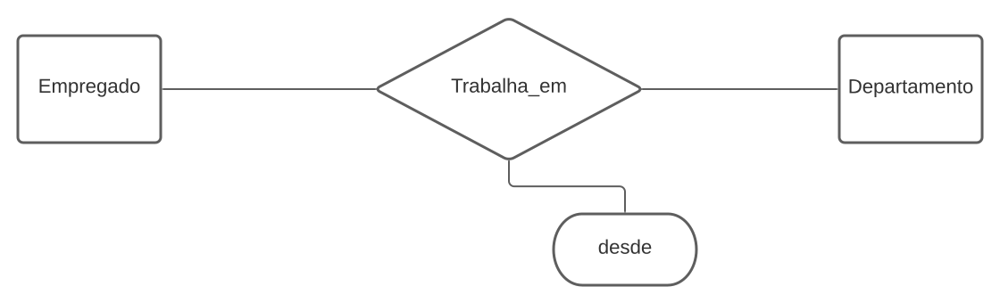
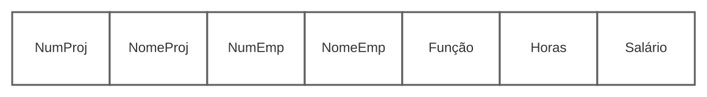
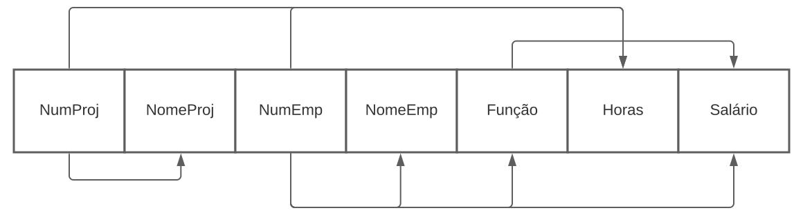
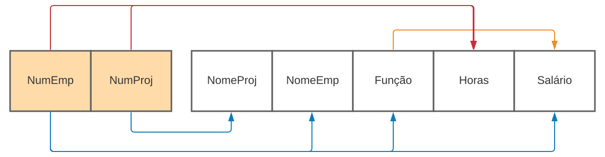
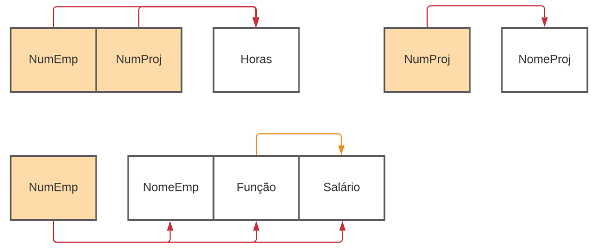
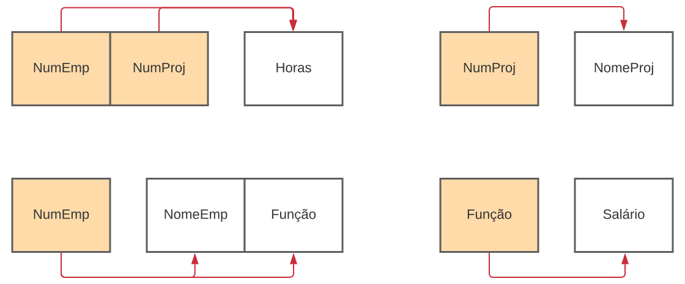

# Base de Dados

## O que é uma base de dados?

Bases de dados são conjuntos de informação organizada. A informação é tipicamente organizada para modelar aspectos relevantes da realidade (por exemplo a disponibilidade de quartos de hoteis), duma forma que ajuda o processo que requer esta informação (por exemplo encontrar um hotel nas férias).
São operados pelos Sistemas Gerenciadores de Bancos de Dados (SGBD)

## O que é um SGBD? (Database Management System)

Um sistema de gestão de base de dados é um pacote de software com programas de computador que controla, mantêm a manutenção e usam a base de dados. Isto permite organizações a desenvolver convenientemente bases de dados para várias aplicações.

A base de dados é uma colecção de informação recolhida, ficheiros e outros objectos enquanto o SGBD possui várias funcionalidades que ajudam na gestão da base de dados (possibilitam o acesso, edição, consulta e inserção de dados).

Principais SGBDS:

- [MySql](https://www.mysql.com/): O MySQL é um dos SGBDS mais utilizados no mundo todo, é uma tecnologia Open Source.
  Uma das características que levam muitas empresas a escolherem o MySQL como SGBD, é que ele é muito simples e é capaz de ser rodado em diferentes sistemas operativos.
- [Oracle Database](https://www.oracle.com/database/): A Oracle é uma das maiores empresas tecnológicas do mundo. Um dos seus principais produtos é o seu SGBD. Ao contrário do MySql, ele não é Open Source.
- [Microsoft SQL Server](https://www.microsoft.com/en-us/sql-server): O SQL Server é o SGBD criado pela Microsoft, foi lançado em 1988 como parte do Windows NT, algum tempo depois ele passou a ser comercializado separado como um único produto.
- [PosgreSQL](https://www.postgresql.org/): O PostgreSQL é um banco de dado relacional Open Source lançado em 1989 e desde então mantém se entre os 5 SGBD mais utilizados do planeta.
- [MongoDB](https://www.mongodb.com/3): MongoDB é um dos SGBD que mais cresceu nos últimos anos. Sendo open source e unindo o melhor dos sistemas relacionais e muitas inovações NoSQL. Esse SGBD possui consultas dinâmicas e também modelos de dados orientados a documentos.

## Modelos de Base de Dados

É um conjunto regras e métodos que permite representar conjuntos de dados (entidades) especificando as relações entre cada um deles.

- **Modelo baseado em objectos**: Procuram representar a realidade através de objetos;
- **Modelo documental**: Projetado para armazenar e consultar dados como documentos do tipo JSON;
- **Modelo baseado em registos**: Procuram representar a realidade através de registos;
- **Modelo hierárquico**: Muito rígido, estrutura em árvore;
- **Modelo em rede**: Implementação difícil e estrutura em rede;
- **Modelo Entidade - Relacionamento (E-R)**: Representa a realidade através da entidade, relacionamento entre as várias entidades e atributos que compõem uma entidade.

## Modelo Entidade Associação

### Entidades

Objeto do mundo real:

- com existência física: Estudante, Departamento
- com existência conceptual: Curso, Turma, Tipo de Estudante

### Associações

Representam interacções entre 2 ou mais entidades.

Exemplo: Carro _**pertence**_ a pessoa.

### Atributos

Num esquema Entidade - Associação os atributos representam os valores que vão ser armazenados na Base de Dados.

#### Simples e Compostos

- Simples ou Atómicos: Não são diviseis.
- Compostos: Divisíveis em atributos simples com significados independentes

#### Valor único e Multi-valor

- Valor único: apenas um valor por entidade
- Multi valor: cada entidade por ter mais do que um valor.

      Uma pessoa pode ter vários números de telefone.

#### Valores Nulos

- Alguns atributos permitem valores nulos. Um valor nulo pode significar que o valor não é conhecido ou que não é aplicável.

#### Atributos Chave

- Atributo, ou conjunto de atributos, que identifica univocamente uma entidade.
- Não podem existir duas entidades do mesmo tipo com o mesmo valor para os seus atributos chave.

      2 carros diferentes não podem ter a mesma matrícula.

### Notação

#### Entidade

Caracteriza-se por um nome e uma lista de atributos.

    Empregado (nome, morada, cidade)

- Atributo Chave: Sublinhado
- Atributo Composto: nome do atributo e lista de subatributos entre parênteses.
- Atributo Multi-valor: entre chavetas

      Empregado (_ BI _, nome, morada (rua, numero, andar), cidade, {telefone})

### Associação

Uma associação relaciona uma ou mais entidades e devem ser usadas sempre que sentimos necessidade de criar um atributo contendo atributos_chave de outra entidade

    Carro pertence a uma pessoa

- As associações são representados pelo seu nome, a lista de entidades que nela partipam e os seus atributos.
- Normalmente usa-se um verbo e tenta-se que este faço sentido ao ser lido pela ordem
- Entidade1 -> associação -> Entidade 2

      pertence_A(Carro, Pessoa)

      tem (Curso, Alunos)

      trabalha_em(Empregado, Departamento, desde)

#### Grau ou Aridade

- Unária ou Reflexiva

    supervisiona(Empregado, Empregado)

- Binárias (as mais comuns)

    pertence_A(Carro, Pessoa)

- Ternárias (podem sempre ser transformadas em Binárias)

    forneceu(Produtor, Produto, Projecto)

#### Cardinalidade

- **N:1 ou 1:N**: muitos para um ou um para muitos
- **1:1**: um para um
- **N:N**: muitos para muitos

      pertence_A(Carro, Pessoa) N:1

      supervisiona(Empregado, Empregado) 1:1

      trabalha_Em(Empregado, Projecto) N:N

#### Participação

- Total: depedência existêncial, espera-se que todas as entidades deste tipo participem na associação (frequente em associação de N:1 do lado do N)
- Parcial: as entidades podem ou não participar na associação

      partenceA(Carro, Pessoa) N:1 t/p

      Todos os carros na base de dados têm de ter um dono mas nem todas as pessoas têm de ser donas de carros

### Exercício Transportadora Área

    Uma transportadora área pretende implmentar uma base de dados com a seguinte informação:
    * A transportadora tem vários aviões. Cada avião tem, para além da matrícula, um nome, a marca do avião, o número de lugares, e indicação da sua autonomia.
    * Na transportadora trabalham vários pilotos.
    * Cada avião faz vários voos. Cada voo deve ter, pelo menos, a indicação da data e hora em que se efectua, dos locais de partida e de destino.
    * Cada voo de um dado avião é pilotado por um piloto.

### Exercício Departamentos

    * Uma empresa está dividida em departamentos.
    * Cada departamento tem um nome, um número e um gerente. Deve ser ainda guardada a data em que o gerente começou a gerir o departamento.
    * Um departamento controla um determinado número de projetos. Cada projeto tem um nome e um número.
    * Para cada empregado, guardar o nome, o número de BI, endereço e salário.
    * Um empregado pertence a um departamento, mas pode trabalhar em vários projectos, que não são necessarimente controlados pelo mesmo departamento.
    * Tomar nota do número de horas por semana que um empregado trabalha num dado projecto.
    * Tomar nota do supervisor directo de cada empregado

### Exercício Oficina

    * Uma loja / oficiona de peças e acessórios para automóveis pretende um sistema de informação que permita a gestão dos seus clientes, peças/ acessórios e serviços efectuados.
    * A loja tem um certo número de empregados para os quais é importante saber o seu número de identificação fiscal (NIF), nome e morada.
    * Na oficiona são efectuados serviços de montagem de peças para os quais é necerssários saber
      - em que carro foi efetuado o serviço
      - o número de kms que o carro tinha na altura
      - qual o empregado responsável
      - que peças foram montadas
      - quantas horas de trabalho foram dispendidas
      - e as datas de entrada, saída prevista e efectiva da viatura
    * As peças só são vendidas em associação com o serviço de montagem. Cada peça só pode ser utilizada em alguns carros.
    * É importante ainda saber a categoria (rádio, pneu, etc), a referência e custo de cada peça
    * Para cada carro é necessário guardar os seguintes dados:
      - matricula
      -modelo
      -marca
      -dados do respectivo dono (NIF, nome, morada, telefone)
    * Considere que uma pessoa pode ser dona de varios carros mas cada carro só pode ter um dono

### Exercício Bicicleta

    * Para cada cliente deve ser possível guardar o seu bi, nif, um nome e uma morada. O bi e o nif devem ser diferentes para cada cliente e não devem existir na base de dados clientes sem nif ou nome.
    * A base de dados deve ainda permitir guardar informações sobre os vários modelos de bicicleta possíveis de serem alugadas. Cada modelo deve ter um nome único, tipo (que apenas pode ser BMX, BTT, Corrida ou Lazer) e o número de mudanças. Cada bicicleta tem um identificador único e um modelo.
    * A empresa tem vários pontos espalhados pelo país onde os clientes podem levantar/depositar as bicicletas. Cada um destes locais é identificado por um nome único que é uma morada (obrigatória).
    * Quando uma reserva é efetuada, é obrigatório saber: que cliente efectou a reserva, em que data vai levantar a bicicleta, qual o modelo da bicicleta desejado e em que local a vai levantar.
    * No momento da entrega da bicicleta ao cliente deve ficar registada qual a bicicleta que foi entregue.
    * No momento da devolução deve ser registada a data em que esta ocorreu.

## Modelo Relacional

O modelo mais comum, o modelo relacional, classifica dados em tabelas, também conhecidas como relações, cada uma das quais consiste em colunas e linhas. Cada coluna lista um atributo da entidade em questão.

| sid  | name  | login    | age | gpa |
| ---- | ----- | -------- | --- | --- |
| 5000 | Dave  | dave@cs  | 19  | 3.3 |
| 5366 | Jones | jones@cs | 18  | 3.4 |

    Students (sid:string, name: string, login: string, age: string, gpa: real)

- Cada coluna é um atributo
- Cada linha é um tuplo

### Chave de uma Relação

- Identifica de forma única os tuplos da relação.
- Conjunto mínimo de atributos da relação tal que não existam 2 tuplos distintos com valores iguais nesses atributos.

#### Chave Candidata

Atributo ou conjunto de atributos que permitem identificar de forma inequívoca qualquer tuplo dessa
relação.

De entre as possíveis chaves candidatas é escolhida uma que será
declarada como chave Primária

#### Chave Primária

- **Unicidade**: o atributo (ou atributos) da chave primária têm um
  valor único para qualquer tuplo da relação.
- **Não nula (Integridade de entidade)**: Não pode haver tuplos da relação que tenham o
  atributo (ou atributos) da chave primária nulos.
- **Não redundante**: Se algum dos atributos que a constituem for
  retirado os restantes deixam de identificar univocamente o
  tuplo.

| Nome   | B.I     | N_contribuinte | N_eleitor | Freguesia | Concelho |
| ------ | ------- | -------------- | --------- | --------- | -------- |
| Maria  | 1234567 | 123456722      | 2222      | S. Pedro  | Covilhã  |
| Manuel | 3377229 | 234156233      | 3333      | Conceição | Covilhã  |

    Chaves candidatas: {B.I.}, {N_Contribuinte}, {N_Eleitor, Freguesia, Concelho}

#### Chave Externa

- Também pode ser chamada de chave estrangeira.
- Atributo (ou conjunto de atributos) que referencia um atributo (ou conjunto de atributos) de uma outra relação.
- O conjunto de atributos referenciados tem de ser uma chave candidata da relação.

      | chave || atributo 1 | atributo2 | # chave externa -> tabela |

##### Restrição de Integridade Referencial

Um tuplo de uma relação que se refira a outra relação, tem de se referir a um tuplo existente nessa relação.

Exemplo:

**Inscriçoes**

| id_est | id_curso |
| ------ | -------- |
| 53666  | LEIC     |
| 53666  | Inglês   |

**Estudantes**

| id_est | nome_estudante | login    |
| ------ | -------------- | -------- |
| 53666  | José           | jose@se  |
| 53688  | Silva          | silva@ei |

- {id_est} é chave externa de Inscrições

## Outras Restrições

- Alguns atributos não podem conter valores nulos
  - NN (Not Null)
- Chaves alternativas obrigam a valores únicos:

  - UK (Unique Key)

## Inserção e Remoção de tuplos

- Inserir tuplos numa relação pode violar tipo de restrições
- Remover tuplos de uma tabela pode apenas violar a integridade referencial

## Conversão Modelo Entidade Associação para Relacional

### Passo 1: Entidade

- Atributos simples da entidade: atributos da relação
- Atributos compostos: atributos individuais
- Atributo chave da entidade: chave da relação

      Empregado (_bi_, nome(primeiroNome, ultimoNome))

      empregado    | bi || primeiroNome | ultimoNome |

### Passo 2: Associação (1 para 1 , 1 para N, N para N)

| Cardinalidade | Participação | Chave Externa                                       | Valores Não Nulos          |
| ------------- | ------------ | --------------------------------------------------- | -------------------------- |
| 1:1           | t/p          | Do lado da participação total. Chave única          | Sem permitir valores nulos |
| 1:1           | p/p          | Em qualquer uma das relações. Chave única           | Permitindo valores nulos   |
| N:1           | t/p          | Do lado do N                                        | Sem permitir valores nulos |
| N:1           | p/p          | Do lado do N                                        | Permitindo valores nulos   |
| N:N           |              | Acrescentar nova tabela com as duas chaves externas |

#### 1 para 1

    Empregado (_bi_, nome(primeiroNome, ultimoNome))
    Departamento (_num_, nome)
    dirige (Empregado, Departamento) 1:1 p/t

    departamento    | num || nome | #bi-> empregado (UK, NN) |

#### 1 para N

    Empregado (_bi_, nome(primeiroNome, ultimoNome))
    Departamento (_num_, nome)
    trabalhaPara (Empregado, Departamento, cargo) N:1 t/p

    empregado    | bi || primeiroNome | ultimoNome | #num-> departamento (NN) | cargo (NN) |

#### N para N

    Empregado (_bi_, nome(primeiroNome, ultimoNome))
    Projecto (_num_, nome)
    trabalhaEm (Empregado, Departamento, horas) N:N p/p

    trabalhaEm    | #bi -> empregado | #num -> projecto  || horas |

### Passo 3: Atributos Multi Valor

Para cada atributo multivalor cria -se uma nova relação que inclui o atributo mais a chave principal da relação que representa a relação que repsenta a entidade que tem o atributo multivalor.

    Departamento (_num_, nome, {telefone})
    telefoneDepartamento    | #num->departamento | telefone ||

### Passo 4: Associação Ternária

    Produto (_id_, nome, preço)
    Projecto (_num_, nome)
    Fornecedor (_nif_, nome)
    encomendou (Projecto, Produto, Fornecedor, quantidade) N:N:N p/p/p

    trabalhaEm    | #id -> produto | #num -> projecto  | #nif-> fornecedor || quantidade |

## Exercício: Pizzaria

    * Cada cliente registado será identificado pelo número de identificação fiscal (único), nome e morada. Todos estes dados são obrigatórios.
    * Os clientes podem guardar no sistema as suas receitas de pizza. Uma pizza pode ser composta por vários ingredientes.
    * Ao criar uma nova receita de pizza o cliente terá de obrigatoriamente atribuir um nome à sua criação. Um cliente não pode ter duas receias com o mesmo nome.
    * Os ingredientes serão identificados pelo seu nome e preço. O nome do ingrefiente será único. É necessário ainda guardar a quantidade em stock de cada ingrediente.
    * Os clientes podem efecturar pedidos que podem ser: take-away ou entrega ao domicílio. Para cada pedido é necessário guardar a data e a hora.
    * Um pedido é composto por várias receitas. Na altura do pedido o cliente pode escolher, para cada uma das receitas o tipo de massa, o tamanho de pizzae a quantidade.

## Exercício: Clínica Veterinária

    * É necessário guardar o nome, a raça e o dono de cada animal. Cada animal deve ter um identificador único.
    * Os dados a reter dos donos dos animais são o nome, morada e número de telefone. Deve ainda ser atribuído um identificador único a cada um.
    * Um animal pode não ter dono. Isto acontece porque frequentemente são tratados animais que são encontrados abandonados.
    * Deve ser possível guardar informação sobre a existência de uma raça na base de dados mesmo sem haver caês dessa raça que frequnetem a clínica.
    * Uma consulta é dada por um méidoco a um animal numa determinada data e hora. As consultas são marcadas de hora a hora.
    * Não podem ser marcadas duas consultas para o mesmo dia, hora e animal ou para o mesmo dia, hora e méidco. Um médico tem um nome, morada, NIF e um NIB.
    * Numa consulta podem ser detectadas várias doenças. Uma doença tem um nome comum e um nome científico.
    * Para além das doenças detectadas, deve ser possível guardar na base de dados informações sobre as doenças mais comuns de cada raça.

## Implementação da BD

### Redundância

- Existência da mesma informação em mais do que um sítio numa base de dados.

| título          | actor             | categoria |
| --------------- | ----------------- | --------- |
| Pulp Fiction    | John Travolta     | Acção     |
| Pulp Fiction    | Samuel L. Jackson | Acção     |
| Pulp Fiction    | Bruce Willis      | Acção     |
| O Sexto Sentido | Bruce Willis      | Drama     |

**Problemas**: Se quisermos alterar a categoria do filme Pulp Fiction temos de o fazer em 3 sítios diferentes...

### Exemplo:

- Neste exemplo:

  - Cada projecto tem um número e um nome
  - Cada empregado tem um número, um nome e uma função
  - Cada empregado trabalha um determinado número de horas no projecto.
  - Cada função tem um salário pré-determinado

### Dependências Funcionais

- Dependências Totais: Quando um atributo depende funcionalmente de toda a chave primária da relação.
- Dependências Parciais: Quando um atributo depende funcionalmente de atributos que fazem parte da chave primária da relação mas não de toda a chave.
- Dependências Transitivas: Quando um atributo que não faz parte da chave primária da relação depende funcionalmente de um atributo que também não faz parte da chave primária da relação.

### 1ª Forma Normal

- Todos os atributos chave estão definidos.
- Todos os outros atributos dependem funcionalmente dos atributos chave.

### 2ª Forma Normal

- Igual à 1ª Forma Normal, mas não podem haver dependências parciais.
- Para chegar à 2ª Forma Normal deve se separar cada componente da chave primária que tenha dependências parciais para uma nova relação.

### 3ª Forma Normal

- Igual à 2ª Forma Normal, mas não podem haver dependências transitivas.
- Para chegar à 3ª Forma Normal deve se criar uma nova relação para os atributos em dependência transitiva.

### Exercícios:

- R(A,B,C,D), DFs : AB->C, C->D, e D->A
- R(A,B,C,D), DFs : AB->C, BC->D, CD->A, e AD->B
