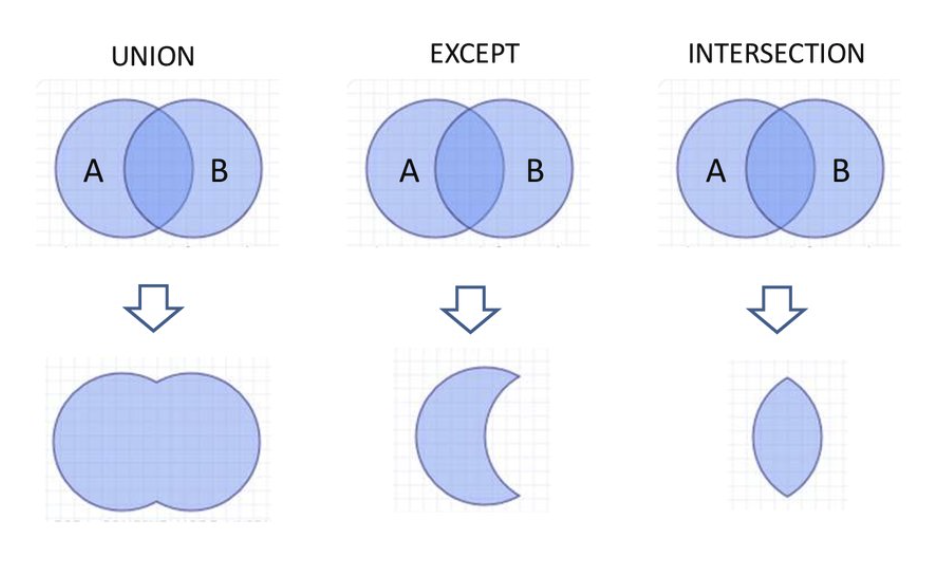

# SQL

Linguagem para definir, manipular e questionar uma Base de Dados Relacional

SQL = DDL + DML + DQL + ...

- DDL: Data Definition Language
- DML: Data Manipulation Language
- DQL: Data Query Language

## SQL - Data Definition Language

### Criação de Tabelas

    create table <nometabela> (
      <nome coluna> <tipo coluna>,
      <nome coluna> <tipo coluna>);

### Remoção de Tabelas

    drop table <nometabela>

### Tipos de Dados

- char(n) - Cadeia de caracteres de tamanho fixo n.
- varchar(n) - Cadeia de caracteres com tamanho máximo n.
- text - Cadeira de caracteres sem tamanho definido.
- int - Números inteiros ( 4 bytes )
- numeric(precisão, escala) - Números reais sem limite de tamanho
- date e time - Data e hora
- timestamp - Data + hora no mesmo campo
- boolean - Valores booleanos


        create table empregado (
            bi integer,
            nome varchar (256),
            salario numeric (9,2),
            datanascimento date
        );

#### Serial Type

No caso da nossa chave primária ser um inteiro sequencial podemos usar o type SERIAL e desta forma é atribuido automaticamente no campo o valor sempre que uma nova entrada é adicionada na tabela. O valor default inicial é 1.

        create table fruit(
                id SERIAL PRIMARY KEY,
                name VARCHAR NOT NULL
        );

#### Valores por Omissão

Podem ser definidos valores por omissão para cada coluna usando a palavra- chave default

        create table empregado (
            bi integer,
            nome varchar (256),
            salario numeric (9,2) default 0,
            datanascimento date
        );

### Restrições de Integridade

- Check
- Not Null
- Unique (Chaves candidatas não primárias)
- Primary Key (Chave candidata primária)
- Foreign Key (Chaves estrangeiras)

#### Restrições Check

Permitem garantir que umas ou mais coluna seguem uma determinada regra que pode ser expressa como uma expressão matemática.

        create table empregado (
            bi integer,
            nome varchar (256),
            salario numeric (9,2)
                default 0
                check (salario >= 0),
            datanascimento date
        );

Podemos e devemos dar sempre nome às restrições

        create table empregado (
            bi integer,
            nome varchar (256),
            salario numeric (9,2)
                default 0,
            constraint sal_positivo check (salario >= 0),
            datanascimento date
        );

No caso da restrição abranger mais do que uma coluna temos de usar uma restrição de tabela

        create table empregado (
            bi integer,
            nome varchar (256),
            salario numeric (9,2),
            descontos numeric (9,2),
            constraint desconto_menor_salario check (desconto < salario)
        );

#### Restrições Not Null

Para garantir que uma coluna não vai ter valores nulos

        create table empregado (
            bi integer,
            nome varchar (256) not null
        );

#### Restrições Chave Primária

Podemos definir uma, e só uma, chave primária para a tabela.
Uma chave primária não pode conter valores nulos nem pode ter valores repetidos

        create table empregado (
            bi integer primary key,
            nome varchar (256) not null
        );

Uma chave primária pode ser composta por mais do que um atributo. Nesse caso temos de usar uma restrição da tabela

        create table empregado (
            pnome varchar (256),
            unome varchar (256),
            datanascimento date,
            primary key (pnome, unome)
        );

#### Restrições Chaves Candidatas

Chaves candidatas alternativas podem ser definidas usando restrições do tipo unique.
Estas restrições são equivalentes às restrições da chave primária mas não obrigam os valores a ser não nulços

        create table empregado (
            bi integer primary key,
            nif integer unique,
            salario numeric(9,2)
        );

Tal como as outras restrições devem ser nomeadas e no caso de incluirem mais do que uma coluna devem ser declaradas como restrições de tabela.

        create table empregado (
            bi integer primary key,
            nif integer constraint nif_unique unique,
            pnome varchar (256),
            unome varchar (256),
            constraint nome_unico unique (pnome, unome)
        );

#### Restrições de Chaves Estrangeiras

Uma restrição do tipo foreign key permite declarar chaves estrangeiras. Uma chave estrangeira deve sempre referenciar uma chave primária ou única

        create table empregado (
            bi integer primary key,
            depid integer references departamento(id)
        );

No caso da coluna referenciada ser a chave primária de outra tabela, podemos omitir o nome da coluna referenciada

        create table empregado (
            bi integer primary key,
            depid integer references departamento
        );

No caso da chave estrangeira ser composta por mais de uma coluna usa-se uma restrição da tabela

        create table empregado (
            bi integer primary key,
            rua varchar (256)
            cidade varchar (256)
            foreign key (rua,cidade) references rua
        );

### Exercício FIFA

     Imagine que tinha sido contratado pela FIFA, para desenhar e implementar uma base de dados que permita gerir a informação sobre os jogadores e equipas de futebol.

        1) Para cada jogadore deve ser guardado: nome, data de nascimento e nacionalidade. Embora seja raro, pode haver jogadores com o mesmo nome.
        2) Um clube de futebol tem um nome, um país ao qual pertence, e um conjunto de jogadores que fazem parte do seu plantel. Num dado instante, um jogador só pode pertencer a um só clube.
        3) Deve ser mantido um histórico de transferências dos jogadores. Uma transferência envolve 5 coisas: um jogador, o clube de origem, o clube de destino, a data de transferência e o montante.

### Exercício Empresa

    Uma empresa pretende criar um sistema de informação para guardar informações referentes às tarefas a executar pelos seus empregados:
    * Cada empregado tem um número identificativo (obrigatório e unico), um nome (obrigatório), uma morada (facultativa) e um contacto telefónico (obrigatório).
    * Uma tarefa tem um id (único), um título, uma descrição, uma data limite de conclusão e uma data efetiva de conclusão. Todos os dados são obrigatórios exceto a data efetiva de conclusão que é apenas preenchida quando a tarefa for terminada.
    * Uma tarefa pode depender de várias outras tarefas e pode ter várias tarefas que dependem dela.
    * Quando uma tarefa é introduzida no sistema deve ficar registado qual o empregado que a introduziu (supervisor da tarefa). Não podem existir tarefas sem supervisor. Mais tarde, a tarefa é atribuida a um empregado (executante).
    * Numa tarefa podem ser utilizados vários tipos de peças. Um tipo de peça é caracterizado por uma referência (única), um nome e uma quantidade em stock. Todos estes dados são obrigatórios.

## SQL - QUERIES

### SELECT + FROM

- Permite selecionar algumas colunas de uma relação.
- Podemos também selecionar todas

        SELECT * FROM autocarro

        | matrícula | marca   | modelo | kms    |
        | 23-43-PG  | Volvo   | 7700   | 5000   |
        | 12-13-AB  | Renault | PR112  | 12000  |
        | 45-38-LH  | Volvo   | 8500   | 5000   |
        | FD-91-00  | Renault | FR1GTX | 112000 |

        SELECT marca, kms FROM autocarro

        | marca   | kms    |
        | Volvo   | 5000   |
        | Renault | 12000  |
        | Volvo   | 5000   |
        | Renault | 112000 |

### SELECT DISTINCT

- Podemos ainda retirar repetidos usando DISTINCT

        SELECT DISTINCT marca, kms FROM autocarro

        | marca   | kms    |
        | Volvo   | 5000   |
        | Renault | 12000  |
        | Renault | 112000 |

### WHERE

- O comando WHERE permite selecionar um sub-conjunto de tuplos de uma relação que satisfazem uma determinada condição sobre alguns atributos.
- A condição pode conter operadores de comparação (<, > , <=, <>, ...)

        SELECT * FROM autocarro
        WHERE marca = 'Volvo' OR kms > 100000;

        | matrícula | marca   | modelo | kms    |
        | 23-43-PG  | Volvo   | 7700   | 5000   |
        | 45-38-LH  | Volvo   | 8500   | 5000   |
        | FD-91-00  | Renault | FR1GTX | 112000 |

### IS NULL

- Se quisermos ficar só com as linhas em que o valor é nulo devemos usar IS NULL
- Se quisermos ficar com as linhas em que um valor não é nulo devemos usar IS NOT NULL

        SELECT * FROM autocarro
        WHERE marca IS NULL;

        SELECT * FROM autocarro
        WHERE marca IS NOT NULL;

### Renomeação de Colunas

- Podemos ainda renomear atributos.

        SELECT kms AS quilometros FROM autocarro;

- Ou efetuar operações aritméticas entre atributos.

         SELECT salariobruto - descontos AS salarioliquido FROM empregado;

### UNION, INTERSECT E EXCEPT



Tendo em conta a seguinte nova relação **autocarro2**

    SELECT * FROM autocarro2

    | matrícula | marca   | modelo |
    | 23-43-PG  | Volvo   | 7700   |
    | 34-91-FC  | Volvo   | 7500   |

- UNION

        SELECT * FROM autocarro1
        UNION
        SELECT * FROM autocarro2

        | matrícula | marca   | modelo |
        | 23-43-PG  | Volvo   | 7700   |
        | 12-13-AB  | Renault | PR112  |
        | 45-38-LH  | Volvo   | 8500   |
        | FD-91-00  | Renault | FR1GTX |
        | 34-91-FC  | Volvo   | 7500   |

- INTERSECT

        SELECT * FROM autocarro1
        INTERSECT
        SELECT * FROM autocarro2

        | matrícula | marca   | modelo |
        | 23-43-PG  | Volvo   | 7700   |

* EXCEPT

        SELECT * FROM autocarro1
        EXCEPT
        SELECT * FROM autocarro2

        | matrícula | marca   | modelo |
        | 12-13-AB  | Renault | PR112  |
        | 45-38-LH  | Volvo   | 8500   |
        | FD-91-00  | Renault | FR1GTX |

### Produto Cartesiano

- Permite-nos combinar tuplos de relações diferentes
- Basta indicar as várias relações no operador FROM usando vírgulas.
- Retorna uma relação com os atributos das várias tabelas e todas as combinações possíveis de tuplos.

Assumindo a tabela marca

    SELECT * FROM marca;

    | nome    | país   |
    | Volvo   | Suécia |
    | Renault | França |

    SELECT * FROM autocarro, marca
    | matrícula | marca   | modelo | kms    | nome    | pais   |
    | 23-43-PG  | Volvo   | 7700   | 5000   | Volvo   | Suécia |
    | 23-43-PG  | Volvo   | 7700   | 5000   | Renault | França |
    | 12-13-AB  | Renault | PR112  | 12000  | Volvo   | Suécia |
    | 12-13-AB  | Renault | PR112  | 12000  | Renault | França |
    | 45-38-LH  | Volvo   | 8500   | 5000   | Volvo   | Suécia |
    | 45-38-LH  | Volvo   | 8500   | 5000   | Renault | França |
    | FD-91-00  | Renault | FR1GTX | 112000 | Volvo   | Suécia |
    | FD-91-00  | Renault | FR1GTX | 112000 | Renault | França |

### Junções usando WHERE

    SELECT * FROM autocarro, marca WHERE marca = nome

    | matrícula | marca   | modelo | kms    | nome    | pais   |
    | 23-43-PG  | Volvo   | 7700   | 5000   | Volvo   | Suécia |
    | 12-13-AB  | Renault | PR112  | 12000  | Renault | França |
    | 45-38-LH  | Volvo   | 8500   | 5000   | Volvo   | Suécia |
    | FD-91-00  | Renault | FR1GTX | 112000 | Renault | França |

### Junções usando JOIN ON (INNER JOIN)

- Este comando permite especificar simultaneamente as tabelas a juntar e a condição de junção

        SELECT * FROM autocarro JOIN ON marca = nome

        | matrícula | marca   | modelo | kms     | pais   |
        | 23-43-PG  | Volvo   | 7700   | 5000    | Suécia |
        | 12-13-AB  | Renault | PR112  | 12000   | França |
        | 45-38-LH  | Volvo   | 8500   | 5000    | Suécia |
        | FD-91-00  | Renault | FR1GTX | 112000  | França |

### Junções usando NATURAL JOIN

- Se quisermos fazer uma junção em que os atributos de junção têm todos o mesmo nome nas duas relações, podemos realizar uma junção natural usando o comando NATURAL JOIN.
- Os atributos repetidos são removidos.

        SELECT * FROM marca

        | marca   | país   |
        | Volvo   | Suécia |
        | Renault | França |


        SELECT * FROM autocarro NATURAL JOIN marca

        | matrícula | marca   | modelo | kms    | pais   |
        | 23-43-PG  | Volvo   | 7700   | 5000   | Suécia |
        | 12-13-AB  | Renault | PR112  | 12000  | França |
        | 45-38-LH  | Volvo   | 8500   | 5000   | Suécia |
        | FD-91-00  | Renault | FR1GTX | 112000 | França |

### Renomeações de Tabelas

    SELECT empregado.nome, supervisor.nome
    FROM empregado, empregado AS supervisor
    WHERE empregado.id_super = supervisor.id


    SELECT empregado.nome, supervisor.nome
    FROM empregado JOIN empregado AS supervisor
    ON empregado.id_super = supervisor.id

### Junção Externa

- Numa junção, os tuplos que não tenham qualquer relação com a outra tabela desaparecem.
- Uma junção externa inclui esses tuplos deixando as colunas da outra tabela com valor nulo.
- As junções externas podem ser à esquerda, à direita ou totais ( LEFT, RIGHT, FULL ).

        SELECT * FROM autocarro LEFT JOIN marca
        ON marca = nome

Tomando agora como exemplo a seguinte tabela **Autocarros**

    SELECT * FROM autoccaro

    | matrícula | marca   | modelo | kms    |
    | 45-38-LH  | Volvo   | 8500   | 5000   |
    | FD-91-00  | NULL    | FR1GTX | 112000 |


    SELECT * FROM marca

    | marca  | país   |
    | Volvo   | Suécia |
    | Renault | França |
    | Scania  | Suécia |


    SELECT * FROM marca FULL NATURAL JOIN autocarro

    | matrícula | marca   | modelo | kms    | pais   |
    | 45-38-LH  | Volvo   | 8500   | 5000   | Suécia |
    | FD-91-00  | NULL    | FR1GTX | 112000 | NULL   |
    | NULL      | Renault | NULL   | NULL   | França |
    | NULL      | Scania  | NULL   | NULL   | Suécia |

### Agregações

- Podemos agregar dados de forma a calcular máximos / mínimos, médias, somas e e fazer contagens ( MAX / MIN, AVG, SUM e COUNT).
- Em SQL é obrigatório indicar quais as colunas que estão a ser agregadas usando o operador GROUP BY.
- O operador HAVING permite fazer uma selecção sobre os resultados agregados.

        SELECT * FROM empregado

        | bi   | nome   | num -> departamento | salário  |
        | 1234 | João   | 1                   | 800      |
        | 2345 | Maria  | 2                   | 900      |
        | 3456 | Carlos | 3                   | 1000     |
        | 4567 | Manuel | 3                   | 700      |
        | 5678 | Joana  | 2                   | 400      |
        | 6789 | Marco  | 2                   | 800      |
        | 7890 | Marta  | 1                   | 1200     |
        | 3467 | Sofia  | 4                   | 750     |


        SELECT num, AVG (salario) AS media
        FROM empregado
        GROUP BY num

        | num | media |
        | 1   | 1000  |
        | 2   | 700   |
        | 3   | 850   |
        | 4   | 750   |


        SELECT num, AVG (salario) AS media
        FROM empregado
        HAVING AVG( salario ) > 750

        | num | media |
        | 1   | 1000  |
        | 3   | 850   |

- O operador de contagem (COUNT), conta o número de valores não nulos no atributo.
- Um caso especial é o COUNT(\*) que conta o número de linhas

        SELECT * FROM DEPARTAMENTO

        | numdep | nome       |
        | 1      | Inglês     |
        | 2      | Matemática |
        | 3      | Física     |
        | 4      | Espanhol     |
        | 5      | Biologia     |


        SELECT departamento.nome, COUNT(*) AS trabalhadores
        FROM departamento
        JOIN empregado ON (numdep = num )
        GROUP BY num, departamento.nome
        HAVING COUNT (*) departmento> 2;

        | nome       | trabalhadores |
        | Inglês     |  3            |
        | Matemática |  3            |
        | Física     |  3            |

### Ordenações

- A resposta a uma query pode ser ordenada segundo uma ou mais colunas.
- Para proceder à ordenação usa-se o comando ORDER BY seguido das colunas que queremos ordenar.
- Por omissão as colunas são ordenadas ascendentemente.
- Podem mudar a direção da ordenação usando ASC e DESC.

        SELECT nome, salario
        FROM empregado
        ORDER BY salario DESC, nome;

### Limitações

- É possível pedir apenas parte dos resultados de uma query.
- O comando LIMIT indica a quantidade de linhas que queremos, enquando o comando OFFSET indica a partir de que linha.

        SELECT salario
        FROM empregado
        ORDER BY salario DESC
        LIMIT 1 OFFSET 5;

### SUB QUERIES

    SELECT nome
    FROM empregado JOIN
        (SELECT num
            FROM departmaento WHERE id <5) AS deps
    ON (id_dep = num)
    WHERE salario > 500

### Operador IN

- O operador IN seleciona as linhas em que os campos indicados antes do operador existam na sub query.
- O operador NOT permite obter o resultado inverso.

        SELECT nome FROM empregado
        WHERE bi NOT IN
            (SELECT bi_dir FROM departamento)

### Operador ANY/SOME e ALL

- O operador ANY seleciona os resultados cujos campos indicados sejam iguais (=), maiores (>), menores (<) ou diferentes (<>) do que pelo menos uma linha da sub query.
- = ANY é igual ao operador IN.
- SOME é o mesmo que ANY

        SELECT nome FROM empregado
        WHERE bi = ANY
        (SELECT bidir FROM` departamento)

- O operador ALL seleciona os resultados cujos campos indicados sejam iguais (=), maiores (>), menores (<) ou diferentes (<>) do que todos os tuplos da sub query.
- <> ALL é o mesmo que NOT IN

### Operador LIKE

- O operador LIKE permite fazer comparações entre campos de texto usando wildcards.
- O caracter % significa qualquer número de caracteres.
- O caracter \_ significa 1 qualquer caracter
- O operador ILIKE tem a mesma funcionalidade mas ignora a capitalização dos caracteres

        SELECT nome FROM empregado
            WHERE nome LIKE 'j%';

### Ordem de Execução

1. São executadas as sub queries
2. São executados todos os produtos cartesianos e joins
3. As tabelas são renomeadas (AS)
4. É executado o comando WHERE
5. É executado o comando GROUP BY
6. É executado o comando HAVING
7. São renomeadas as colunas (AS)
8. É executado o comando ORDER BY
9. É executado o comando LIMIT
10. E só no fim o comando SELECT

### Exercícios

1. Considere uma base de dados semelhante a seguinte, em que se guardam dados sobre pasteís e cozinheiros, bem como sobre os pasteis que cada cozinheiro sabe preparar

   ```
    Tabela Pastel                        Tabela cozinheiro                          Tabela prepara

    | designação      | preço |          |contribuinte | nome   | salário |         | designação     | contribuinte |
    | pastel de natal | 0.80  |          | 210210      | João   | 500     |         | pastel de nata | 210210       |
    | bola de berlim  | 1.20  |          | 312312      | Pedro  | 600     |         | pastel de nata | 3123123      |
                                         | 45645       | Susana | 550     |         | bola de berlim | 312312       |

    a) Quem são os cozinheiros que sabem preparar pasteís com preço superior a 1,50? Na resposta indique o nome do cozinheiro e a designação do pastel.
    b) Quem é o cozinheiro de salário mais elevado que sabe preparar bolas de Berlin? Na resposta indique o salário e o nome deste cozinheiro.
    c) Quantos cozinheiros sabem preparar cada tipo de pastel? Considere apenas os cozinheiros com salário superior a 500. Na resposta, indique a designação do pastel e o número de cozinheiros.
    d) Quem são os cozinheiros que só sabem fazer pasteis de nata? Na resposta, identifique o cozinheiro pelo número de contribuinte.
    e) Quem é o cozinheiro que sabe preparar mais pasteis? Na resposta, indique o contribuinte e o número de pasteis que o cozinheiro sabe preprar.
    f) Se todos os cozinheiros com nome terminado em 'o' fizerem greve, quais são os pasteis que a pasteleria pode fazer nesse dia? Na resposta, não apresente duplicados.

   ```

2. Observe o seguinte esquema:

**Flights**: | flno || from | to | distance | departs | arrives | price |

**Aircraft**: | aid || aname | cruisingrange |

**Employees**: | eid || ename | salary |

**Certified**: |#eid -> Employees | #aid -> Aircraft ||

    a) Encontre os nomes dos voos cujo piloto ganhe mais de 80,000
    b) Para cada piloto que tenha mais de 3 aviões, encontre o identificador e o valor máximo de cruising range
    c) Encontra o nome dos pilotos cujo salário é menos que o preço de viagem de Los Angeles to Honolulu
    d) Para um avião com cruisingrange com mais de 1000 milhas, encontra o nome do avião e o salário médios dos pilotos certificados para esse avião.
    e) Encontre o nome dos pilotes certificados por uma avião Boeing
    f) Encontre os aviões que podem ser usados de Los Angeles a Chicago
    g) Identifice as rotas que podem ser pilotadas por todos os pilotos que ganham mais de que 100 000$.
    h) Mostre a diferença entre o salário médio de um piloto em relação a todos os funcionários.
    i) Imprima o nome e o salário de todos os funcionários não-pilotos cujo salário é maior que média dos salários dos pilotos.
    j) Imprima os nomes dos empregados que são certificados apenas em aviões com cruising range maior que 1000 milhas, mas que pilotom pelo menos 2 aviões.

## SQL - MANIPULAÇÃO de DADOS

### Inserções

- O comando INSERT INTO é utilizado para inserir um novo tuplo na relação.
- Se forem indicadas as colunas em que queremos inserir os dados, as restantes ficarão com o seu valor por defeito ou nulos.
- Podemos não indicar as colunas em que queremos inserir, sendo neste caso obrigatório seguir a mesma ordem pela qual criamos a tabela.

        INSERT INTO empregado VALUES (12, 'Joao', 500)
        INSERT INTO empregado (id, nome) VALUES (12, 'joao')
        INSERT INTO empregado VALUES (12, 'Joao', DEFAULT)

### Remoções

    DELETE FROM empregado WHERE salario > 2000;

### Actualizações

    UPDATE empregado
    SET nome='Joao', salario = 1200
    WHERE bi=1234;
