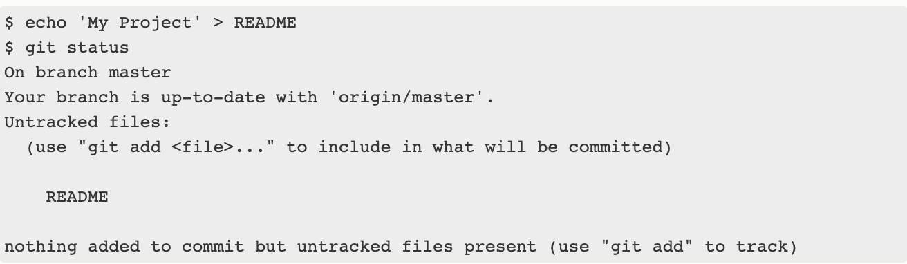

# Git

## Git Setup ##
    brew install git

## Git Config ##

1. Set a Git user name:
   
   **git config --global user.name "exampleUsername"**
2. Set a Git email:

    **git config --global user.email "email@example.com"**

3. Check with **git config --list**

## Starting A New Repo ##

1. Cloning External Repo

    **git clone**
    
    

2. Start Locally  

    **git init**

    Git will reply: *Initialized empty Git repository in .git/*

## Making Changes Locally ##

1. Checking Status
    
    **git status** 
    
    
    
    The main tool you use to determine which files are in which state is the git status command. If you run this command directly after a clone, you should see something like this:
    
    
    
    Let’s say you add a new file to your project, a simple README file. If the file didn’t exist before, and you run git status, you see your untracked file like so:
    
    
    
2. Tracking New Files 
    
    **git add**: 
    
        1. git add --all (add all files)
        2. git add filename
    
    
    
3. Staging Modified Files

     If you change a previously tracked file and then run your git status command again, you get something that looks like
     
     
     
     The changed file appears under a section named “Changes not staged for commit” — which means that a file that is tracked has been modified in the working directory but not yet staged.
     
     To stage it, you run the git add (you use it to track files and to stage).  
    
4. Checking Differences 

    **git diff**:  it shows all staged changes
    
5. Commit Your Work

    **git commit**
    
    The git commit command captures a snapshot of the project's currently staged changes. Committed snapshots can be thought of as “safe” versions of a project—Git will never change them unless you explicitly ask it to.
    
## REMOTE REPO ##

1. **git push** 

    Push - pushing sends the recent commit history from your local repository up to GitHub. ...
2. **git pull** 

    Pull - a pull grabs any changes from the GitHub repository and merges them into your local repository.
    
    

